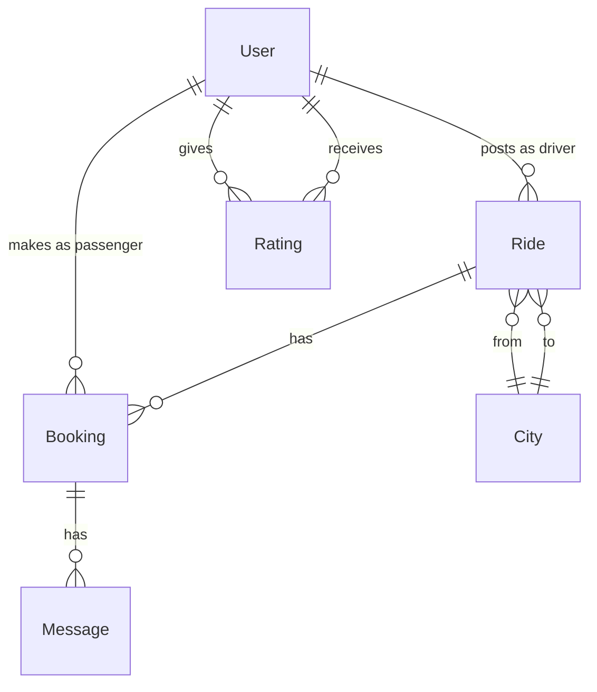

# Data Model: AlbaniaRides Platform

## Entity Relationship Diagram



## Entities

### User
Primary entity representing both drivers and passengers.

```typescript
interface User {
  id: string;                    // UUID
  phone_number_encrypted: string; // Encrypted +355 number
  phone_hash: string;             // For unique constraint
  name: string;                   // Full name (required)
  photo_url?: string;             // Profile photo URL
  city: string;                   // City of residence
  bio?: string;                   // Short bio (max 500 chars)

  // Driver-specific fields
  is_driver: boolean;             // Can post rides
  car_model?: string;             // e.g., "Toyota Corolla"
  car_color?: string;             // e.g., "Silver"
  driving_years?: number;         // Years of experience

  // Computed fields
  rating: number;                 // Average rating (1-5)
  total_rides: number;            // Completed rides count
  member_since: Date;             // Registration date

  // Auth & status
  verified_at?: Date;             // Phone verification timestamp
  suspended_at?: Date;            // Suspension timestamp
  suspension_reason?: string;     // Why suspended
  deleted_at?: Date;              // Soft delete for GDPR

  created_at: Date;
  updated_at: Date;
}

Constraints:
- phone_hash must be unique
- name required, 2-100 characters
- bio maximum 500 characters
- rating between 1.0 and 5.0
- Only verified users can post rides or book
```

### Ride
Represents a trip offer from a driver.

```typescript
interface Ride {
  id: string;                     // UUID
  driver_id: string;              // FK to User

  // Route information
  origin_city: string;            // From Albanian cities list
  destination_city: string;       // To Albanian cities list
  stops?: string[];               // Optional intermediate stops
  pickup_point: string;           // Exact pickup location

  // Schedule
  departure_time: Date;           // When ride departs
  estimated_duration: number;     // Minutes (calculated)

  // Capacity & pricing
  seats_total: number;            // Total seats available (1-4)
  seats_available: number;        // Remaining seats
  price_per_seat: number;         // Price in ALL

  // Preferences
  luggage_space: boolean;         // Has luggage space
  smoking_allowed: boolean;       // Smoking preference

  // Recurring rides
  is_recurring: boolean;          // Is this recurring
  recurrence_pattern?: string;    // 'daily' | 'weekly'
  recurrence_end_date?: Date;     // When pattern ends
  parent_ride_id?: string;        // Original recurring ride

  // Status
  status: string;                 // 'active' | 'completed' | 'cancelled'
  completed_at?: Date;            // Completion timestamp
  cancelled_at?: Date;            // Cancellation timestamp
  cancellation_reason?: string;   // Why cancelled

  created_at: Date;
  updated_at: Date;
}

Constraints:
- seats_total between 1 and 4
- seats_available <= seats_total
- price_per_seat > 0
- departure_time must be future
- origin_city != destination_city
```

### Booking
Links passengers to rides.

```typescript
interface Booking {
  id: string;                     // UUID
  ride_id: string;                // FK to Ride
  passenger_id: string;           // FK to User

  // Booking details
  seats_booked: number;           // Number of seats (1-4)
  total_price: number;            // seats_booked * price_per_seat
  pickup_point: string;           // Confirmed pickup location
  passenger_message?: string;     // Optional message to driver

  // Status
  status: string;                 // 'confirmed' | 'cancelled' | 'completed'
  confirmed_at: Date;             // Booking confirmation time
  cancelled_at?: Date;            // Cancellation timestamp
  cancelled_by?: string;          // 'passenger' | 'driver' | 'system'
  cancellation_reason?: string;   // Why cancelled
  completed_at?: Date;            // Trip completion time

  // SMS tracking
  sms_sent_at?: Date;             // When SMS notifications sent
  sms_delivery_status?: string;   // 'pending' | 'delivered' | 'failed'

  created_at: Date;
  updated_at: Date;
}

Constraints:
- seats_booked between 1 and 4
- seats_booked <= ride.seats_available
- No duplicate bookings (same passenger, same ride)
- Cancellation only if departure_time > 2 hours away
```

### Rating
Mutual ratings between drivers and passengers.

```typescript
interface Rating {
  id: string;                     // UUID
  ride_id: string;                // FK to Ride
  booking_id: string;             // FK to Booking

  // Who rates whom
  rater_id: string;               // FK to User (who gives rating)
  rated_id: string;               // FK to User (who receives rating)
  rater_type: string;             // 'driver' | 'passenger'

  // Rating details
  stars: number;                  // 1-5 stars
  comment?: string;               // Optional text (max 500 chars)

  // Visibility
  is_visible: boolean;            // True after mutual rating or timeout
  visibility_date: Date;          // When became visible

  created_at: Date;
  updated_at: Date;
}

Constraints:
- stars between 1 and 5
- comment maximum 500 characters
- One rating per rater per ride
- Only after ride completion
```

### Message
In-app messaging between confirmed pairs.

```typescript
interface Message {
  id: string;                     // UUID
  booking_id: string;             // FK to Booking
  sender_id: string;              // FK to User
  receiver_id: string;            // FK to User

  // Message content
  content: string;                // Message text
  is_quick_message: boolean;      // Used pre-written template

  // Status
  read_at?: Date;                 // When message was read

  created_at: Date;
}

Constraints:
- content maximum 1000 characters
- Only between confirmed booking parties
- Auto-delete after 30 days
```

### City
Static reference data for Albanian cities.

```typescript
interface City {
  code: string;                   // Primary key (e.g., 'TIA')
  name: string;                   // Display name (e.g., 'Tirana')
  name_sq: string;                // Albanian name (e.g., 'Tiranë')
  latitude: number;               // GPS latitude
  longitude: number;              // GPS longitude
  region: string;                 // Geographic region
  population: number;             // Approximate population
  is_major: boolean;              // Major city flag
}

// Static data (not user-editable)
const CITIES = [
  { code: 'TIA', name: 'Tirana', name_sq: 'Tiranë', lat: 41.3275, lng: 19.8189 },
  { code: 'DUR', name: 'Durrës', name_sq: 'Durrës', lat: 41.3246, lng: 19.4565 },
  { code: 'VLO', name: 'Vlorë', name_sq: 'Vlorë', lat: 40.4660, lng: 19.4914 },
  // ... all 15 cities
];
```

### CityRoute
Pre-calculated distances between city pairs.

```typescript
interface CityRoute {
  id: string;                     // Composite: origin_destination
  origin_code: string;            // FK to City.code
  destination_code: string;       // FK to City.code
  distance_km: number;            // Road distance
  typical_duration_min: number;   // Typical driving time
  toll_roads: boolean;            // Has toll roads

  // Popular pickup points
  popular_pickups: string[];      // Common pickup locations
}

// Pre-populated for all city pairs
```

## Database Indexes

```sql
-- User indexes
CREATE INDEX idx_users_phone_hash ON users(phone_hash);
CREATE INDEX idx_users_city ON users(city);
CREATE INDEX idx_users_rating ON users(rating DESC);

-- Ride indexes
CREATE INDEX idx_rides_route ON rides(origin_city, destination_city, departure_time);
CREATE INDEX idx_rides_driver ON rides(driver_id);
CREATE INDEX idx_rides_status ON rides(status);
CREATE INDEX idx_rides_departure ON rides(departure_time) WHERE status = 'active';

-- Booking indexes
CREATE INDEX idx_bookings_ride ON bookings(ride_id);
CREATE INDEX idx_bookings_passenger ON bookings(passenger_id);
CREATE INDEX idx_bookings_status ON bookings(status);

-- Rating indexes
CREATE INDEX idx_ratings_ride ON ratings(ride_id);
CREATE INDEX idx_ratings_rated ON ratings(rated_id);

-- Message indexes
CREATE INDEX idx_messages_booking ON messages(booking_id);
CREATE INDEX idx_messages_created ON messages(created_at);
```

## Row-Level Security Policies

```sql
-- Users can view all profiles but edit only their own
CREATE POLICY users_select ON users FOR SELECT USING (true);
CREATE POLICY users_update ON users FOR UPDATE USING (auth.uid() = id);

-- Rides are public to view, editable by owner
CREATE POLICY rides_select ON rides FOR SELECT USING (status = 'active');
CREATE POLICY rides_insert ON rides FOR INSERT WITH CHECK (auth.uid() = driver_id);
CREATE POLICY rides_update ON rides FOR UPDATE USING (auth.uid() = driver_id);

-- Bookings visible to involved parties
CREATE POLICY bookings_select ON bookings FOR SELECT USING (
  auth.uid() = passenger_id OR
  auth.uid() IN (SELECT driver_id FROM rides WHERE id = ride_id)
);

-- Messages only between booking parties
CREATE POLICY messages_select ON messages FOR SELECT USING (
  auth.uid() IN (sender_id, receiver_id)
);

-- Ratings visible after mutual rating or timeout
CREATE POLICY ratings_select ON ratings FOR SELECT USING (
  is_visible = true OR rater_id = auth.uid()
);
```

## State Transitions

### Ride States
```
created → active → completed
              ↓
          cancelled
```

### Booking States
```
created → confirmed → completed
              ↓
          cancelled
```

## Data Retention

- **User data**: Soft delete, hard delete after 30 days
- **Rides**: Keep for 1 year for analytics
- **Bookings**: Keep for 1 year for disputes
- **Messages**: Auto-delete after 30 days
- **Ratings**: Keep indefinitely for trust scores

## GDPR Compliance

1. **Right to Access**: User export endpoint returns all data
2. **Right to Deletion**: Soft delete immediate, hard delete in 30 days
3. **Data Minimization**: Only collect necessary fields
4. **Encryption**: Phone numbers encrypted at rest
5. **Consent**: Explicit checkbox at registration